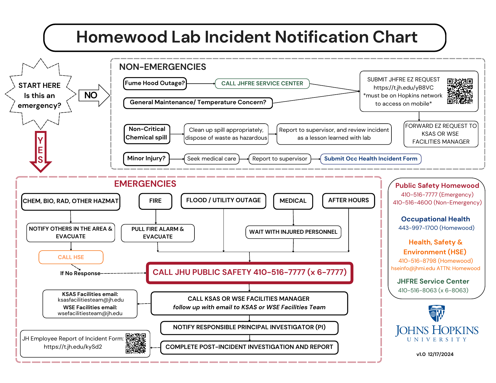

# Emergency Quick Reference

!!! danger "Protect people first"
    In any emergency, protect people first. Stop work, move away from the hazard if it is safe to do so, alert nearby occupants, and call for help.

## Incident Notification Flowchart

*Select the chart to open the original PDF. Source: Homewood Lab Incident Notification Chart, version 1.0, December 17, 2024.*

| Situation | First action | Whom to contact |
| --- | --- | --- |
| Life safety emergency, fire, serious injury, threat | Evacuate or move to safety, then call immediately. | **JHU Security emergency: 410-516-7777.** From a campus phone, call **6-7777** or **911**. |
| Medical incident requiring more than first aid | Call Security and stay with the person if safe. | Security: **410-516-7777**. Notify Matt Shaeffer or Joseph Nkansah-Mahaney after urgent response is underway. |
| Minor injury | Provide first aid if trained; seek evaluation as appropriate. | During business hours, contact the appropriate health service. Outside business hours, call Security. |
| Fire or fire alarm | Evacuate. Do not attempt to fight the fire unless you are specifically trained and authorized. | Pull the nearest alarm if needed, evacuate to the rally point, and call Security. |
| Chemical or hazardous material spill | Notify lab engineers. Do not clean unless trained and the spill is small and low hazard. | Matt Shaeffer / Joseph Nkansah-Mahaney. If unavailable or unsafe, call Security. |
| Facilities emergency: leak, gas line problem, unsafe building condition | Notify lab engineers. If unavailable and there is a safety issue, call Security. | Lab engineers first; Security for emergencies; Facilities issue line: **410-516-8063** or Transwestern: **443-997-0680**. |

!!! warning "Call campus responders directly"
    **Important:** dialing 911 from a wireless phone may reach a Baltimore City dispatcher before campus responders. When on campus, call **JHU Security at 410-516-7777** so they can respond quickly and coordinate local emergency services.

!!! info "Required internal notification"
    After immediate hazards are controlled or emergency responders have been contacted, notify the AIMDL lab engineers. The lab engineers will notify the Principal Investigator unless circumstances require direct PI notification.

## Emergency and AIMDL Contacts

| Role / Office | Contact | Phone |
| --- | --- | --- |
| Emergency response | JHU Security emergency | **410-516-7777** |
| Security non-emergency | JHU Security non-emergency | 410-516-4600 |
| Facilities issue line | Homewood Facilities | 410-516-8063 |
| Building facilities contact | Transwestern / Building Engineer | 443-997-0680 |
| Principal Investigator | Todd Hufnagel | 410-209-7404 |
| Senior Engineer / Lab Manager | Matt Shaeffer | 443-756-4387 |
| Staff Engineer | Joseph Nkansah-Mahaney | 714-609-7954 |

For additional health, safety, and laboratory contacts, see [Contacts and Hazard Reference](contacts-reference.md).
