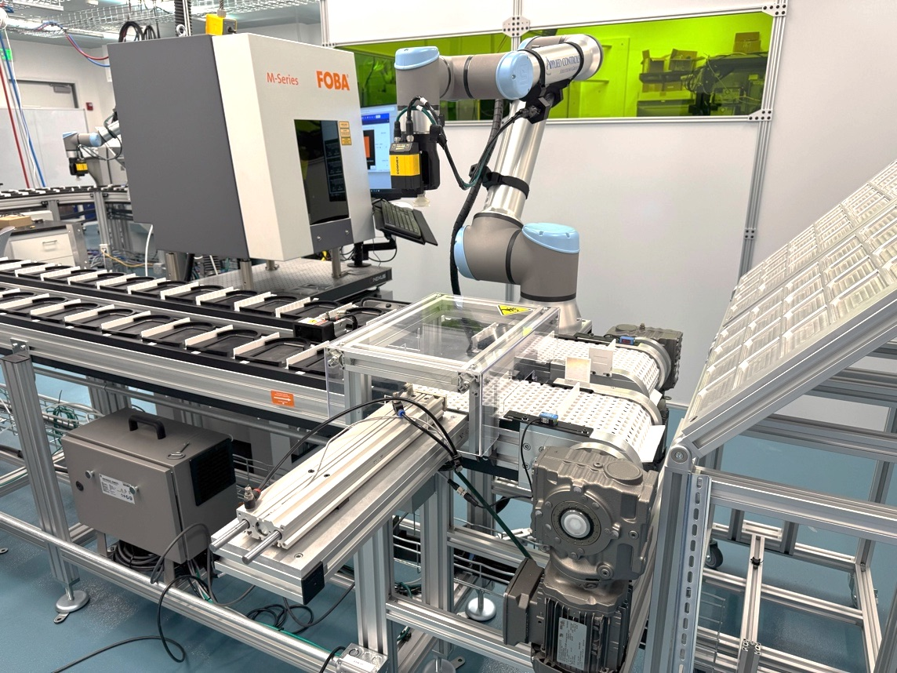
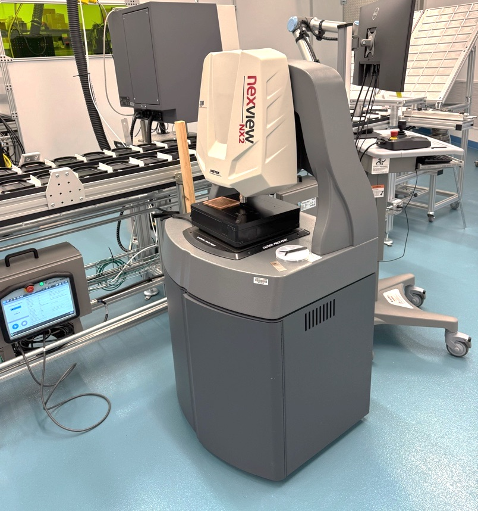
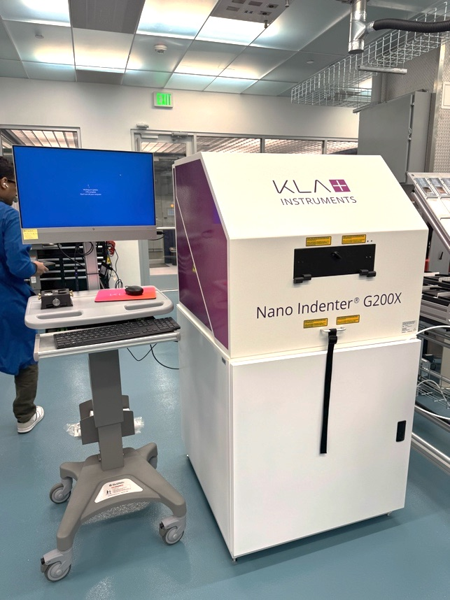
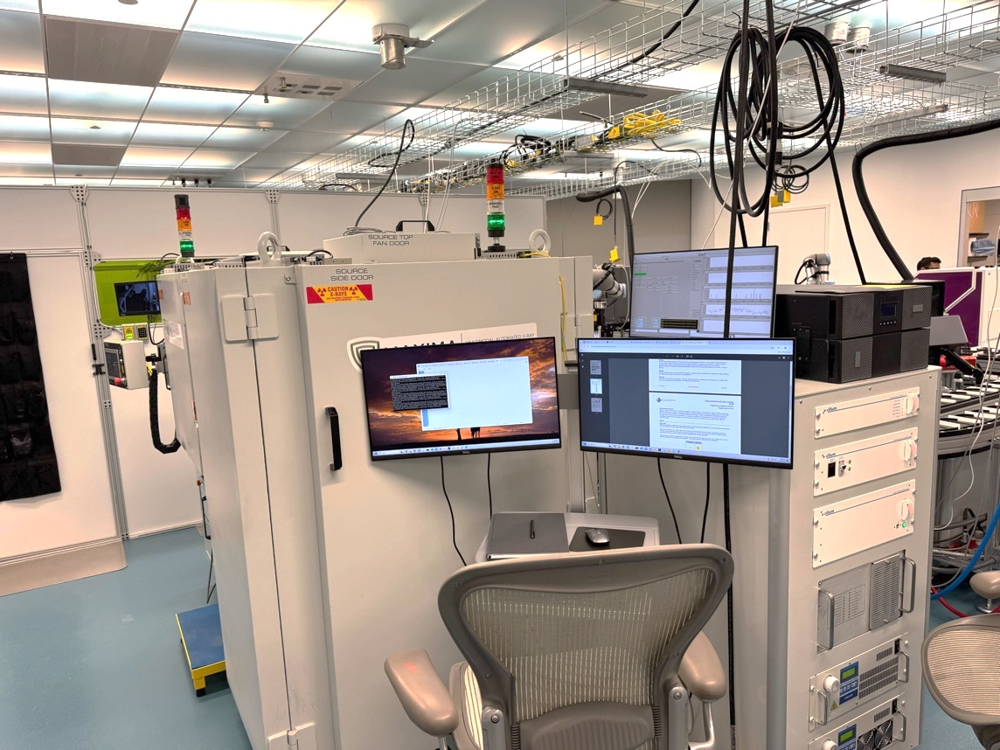
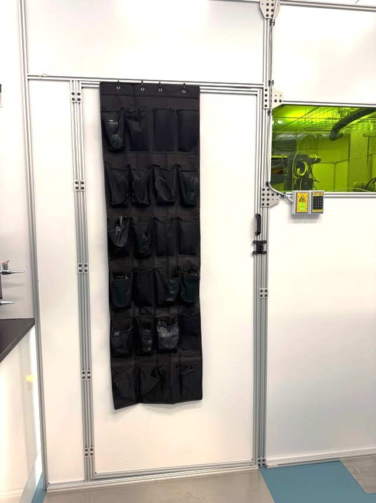
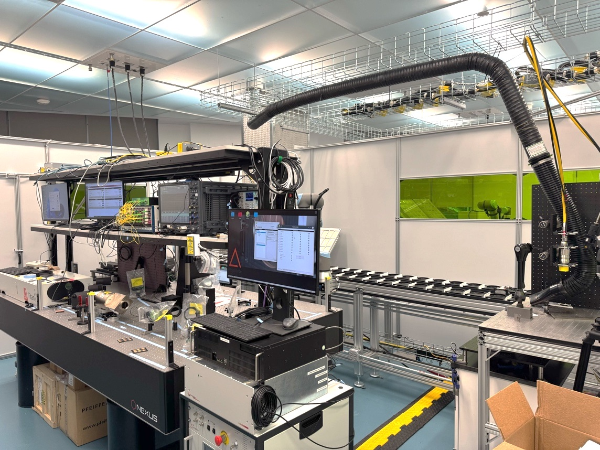
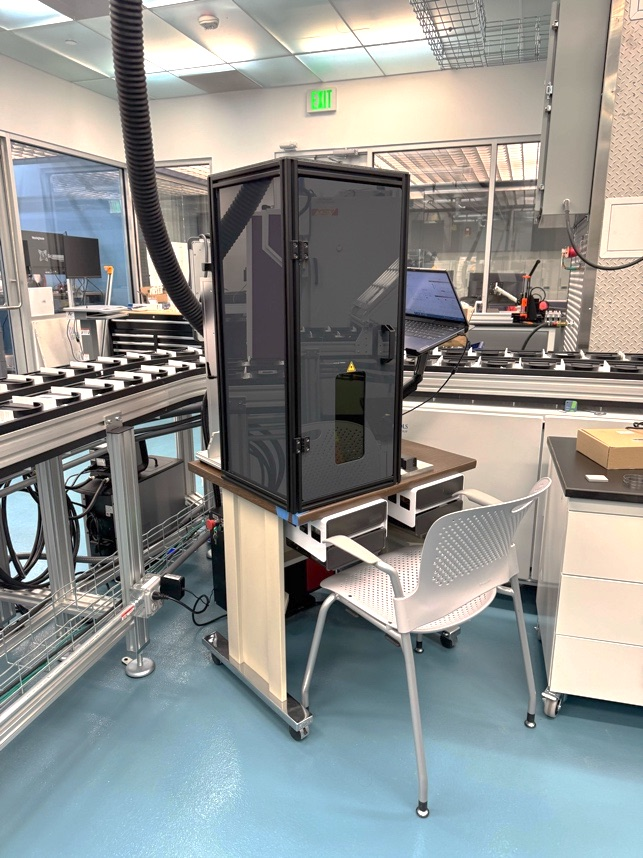
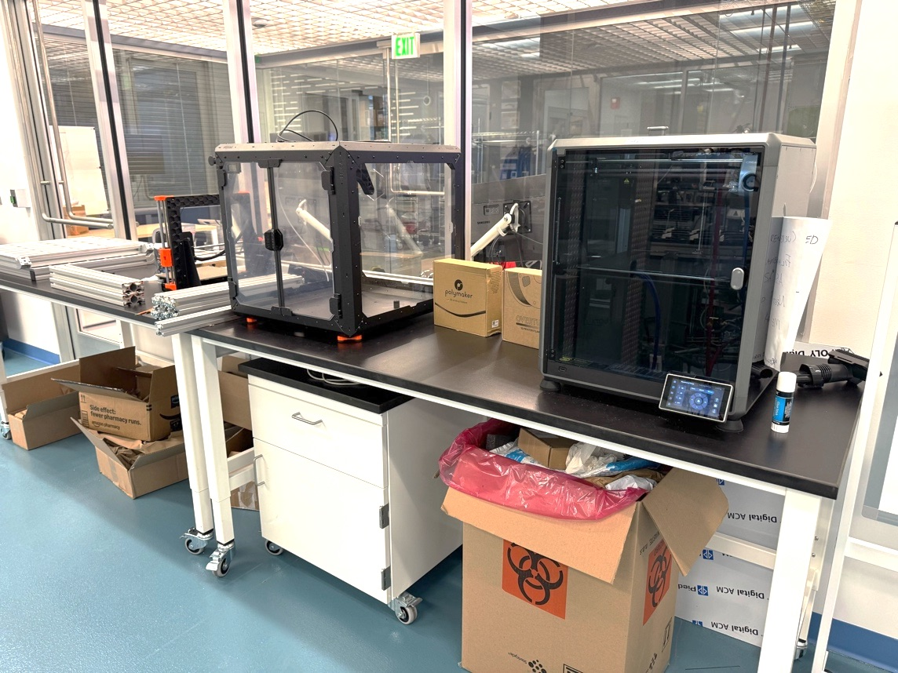
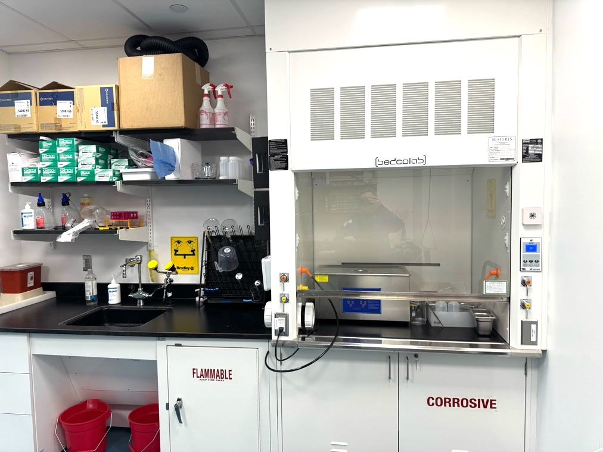
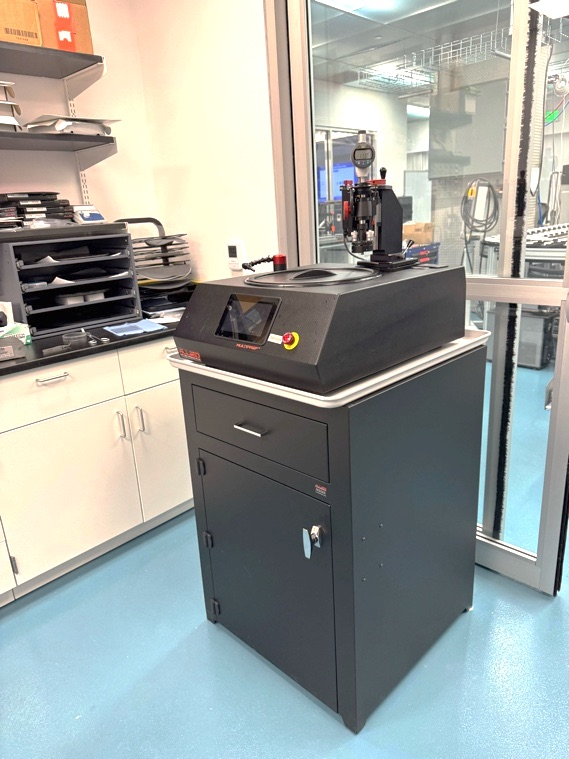

# Equipment and Station Safety

!!! warning "Safety overview - not an operating procedure"
    This page summarizes the equipment and station hazards contained in the global AIMDL safety document. It does not replace equipment-specific SOPs, manufacturer instructions, required training, or hands-on authorization.

## Global Room E-Stops

The AIMD Laboratory has several Global Room E-stops positioned around the lab. They are positioned as indicated in [Figure 1 on the Lab Layout page](lab-layout.md) and are covered by protective plastic to avoid accidental push. These buttons tie into the lab safety PLC and will immediately shut down the HELIX Pulsed Laser, HELIX heating laser, the HELIX enclosure interlock, the UR10e robots and automated material handling system conveyance, and MAXIMA.

The Global E-Stop should only be used if there is a risk to personnel safety or there is a hazard that could put the lab at risk. For lower-risk stop requirements, it is better to use controlled shutdowns or local E-stops if needed. Global E-stops can result in equipment damage in certain circumstances and thus should be used only if necessary. Several instruments have more localized E-stops that are preferential for instrument-specific needs.

## Automated Material Handling System

*Figure 3a. Automated material handling system with sample conveyance, transfer station, UR10e robot arm, and FOBA laser engraver.*

### Purpose and major components

The automated material handling system consists of a two-lane belt conveyance and six UR10e collaborative robots. The U-shaped conveyance uses motor-driven belts moving in opposing directions and pneumatic transfer pistons to move materials between lanes. UR10e robots and pneumatic clamps service testing and processing stations by moving materials to and from the conveyance.

### Primary hazards

- Pinch and impact hazards from belts, gears, pneumatic actuators, clamps, transfer pistons, and robot motion.
- Unexpected motion during automated sequences or programming.
- Compressed-air hazards and trip hazards from associated lines and cables.

### General precautions

- Stay clear of robots, conveyors, clamps, and transfer pistons during operation.
- Do not lean on, reach into, or store objects on the conveyance during operation.
- Secure loose items, tools, cables, and materials so they cannot be caught in belts or moving parts.
- Follow all instructions from the system operator and equipment-specific SOPs.

### Emergency stop / shutdown

Robot control pendants located near the base of each robot include E-stop buttons. Pressing an E-stop halts robot and conveyance operation. Users must know the nearest E-stop before work begins.

## FOBA M1000 Laser Engraving System

### Purpose and major components

The FOBA M1000 is an AIMDL processing element that uses a Class 4 infrared laser at 1064 nm, a Class 1 enclosure, a laser head containing moving mirrors and optics, and a control system. It may be used with the UR10e robot at the infeed/outfeed station or as a standalone system.

### Primary hazards

- Class 4 infrared laser radiation if the Class 1 enclosure condition is not maintained.
- Door motion and laser-head motion that may strike the operator, robot, or equipment.
- Fire or combustion risk from inappropriate materials in the beam path.
- Laser-generated fumes or particulates if ventilation is not operating correctly.

### General precautions

- Operate only with required training and applicable SOPs.
- Confirm that the enclosure door is closed and interlocked before lasing.
- Stand clear of the door motion and to the right of the machine (facing it) during operations involving the robot.
- Confirm the enclosure is connected to ventilation and that sufficient exhaust flow is present before operation.
- Use only approved materials and monitor continuously for smoke, combustion, or abnormal behavior.

### Emergency stop / shutdown

The FOBA E-stop is located on the right side of the enclosure and should be used to stop operation immediately if unsafe conditions arise.

## Optical Profilometer

*Figure 3b. Zygo Nexview N2 optical profilometer.*

### Purpose and major components

The Zygo Nexview N2 optical profilometer uses white-light and phase-interferometric techniques, a motorized XYZ stage, and an active isolation table supplied with compressed air to measure surface topography at high resolution.

### Primary hazards

- Pinch points from motorized stages and moving work surfaces.
- Compressed-air connections and trip hazards.
- Robot motion hazard during future or active integration with nearby UR10e automation.

### General precautions

- Use care around the instrument to avoid damaging sensitive components or disrupting measurements.
- Keep clear of the UR10e robot during automated operation.
- Do not reach into moving stages or interfere with an active measurement.

### Emergency stop / shutdown

The profilometer has an E-stop on the joystick controller that shuts down the system when pressed.

## SPHINX

*Figure 4a. SPHINX system, consisting of a KLA G200X nanoindenter with laser heating capability.*

### Purpose and major components

The SPHINX system consists of a KLA G200X nanoindenter that uses a nanoscale tip to probe mechanical properties of materials. It includes XYZ stages, sensitive internal components, laser heating capability, vacuum connections, and chilled-water lines.

### Primary hazards

- Pinch hazard from XYZ stages when the enclosure is open during operation.
- Laser hazard during laser-heating operation if enclosure and interlocks are not in the required state.
- Risk of equipment damage from contacting the indenter tip or internal gantry.

### General precautions

- Do not reach into the test gantry unless trained and authorized.
- Keep the enclosure closed when required for laser heating operation.
- Stay clear of the robot and stage area during automated operation.
- Protect vacuum and chilled-water lines from damage and report leaks promptly.

### Emergency stop / shutdown

Follow the SPHINX nanoindenter SOP for shutdown steps and emergency stop locations. If unsafe motion, leak, or laser-related concern occurs, stop the operation and contact AIMDL staff.

## MAXIMA XRD/XRF System

*Figure 4b. MAXIMA XRD/XRF system.*

### Purpose and major components

The MAXIMA system, built by Proto Manufacturing LTD, provides microstructure and compositional analysis using high-flux X-rays. It integrates a high-intensity X-ray source, internal UR3e robot, lead-steel interlocked enclosure, rear sample-entry door, and interaction with an external UR10e for sample handoff.

### Primary hazards

- X-ray radiation if shielding or interlocks are compromised.
- High voltage and high vacuum hazards near power supplies and source components.
- Severe pinch hazards from heavy doors and automated handoff hardware.
- Robot motion hazards during sample transfer.
- Compressed-gas hazards from the nitrogen cylinder used for detector operation.

### General precautions

- Operate only when trained, authorized, and following MAXIMA and AIMDL procedures.
- Keep access panels closed unless instructed by AIMDL staff or Proto Manufacturing.
- Avoid cables, cooling tubes, and wiring between the power supply and main cabinet.
- Stay clear of the UR10e-MAXIMA interaction area and the automated sample handoff door.
- Do not interrupt the light-sheet interlock at the sample handoff door during automated operation.
- Replace nitrogen cylinders only if trained by AIMDL staff to change cylinders and install regulators. Move cylinders only with an approved cylinder cart.

### Emergency stop / shutdown

MAXIMA has E-stops on the internal robot pendant and on the system HMI. The central robotics E-stop also affects the system unless the system is bypassed under authorized conditions. The bypass switch in the MAXIMA PLC cabinet must not be used except by authorized AIMDL staff under approved procedures.

## HELIX Laser Shock Test Area

*Figure 5a. Primary door to the HELIX laser enclosure.*

*Figure 5b. HELIX laser shock testing subsystem with lasers, instruments, robots, and conveyance.*

### Purpose and major components

The HELIX laser shock test area is an enclosed AIMDL location containing three infrared lasers: an Amplitude Titan 1064 nm, 7.5 J, 10 ns pulsed laser; a Coherent 980 nm, 300 W continuous-wave laser; and a QuantiFi 1550 nm solid-state laser. The area also includes an XY motion stage, pneumatic transfer piston, pneumatic clamp actuator, two UR10e collaborative robots, optics, and supporting ventilation and cooling systems.

### Primary hazards

- Class 4 infrared laser exposure, including direct, reflected, diffuse, or invisible beam exposure.
- Burn and fire hazards from materials in or near laser beam paths.
- Robot, stage, conveyance, pneumatic, and clamp motion hazards.
- Trip, slip, and leak hazards from cables, hoses, chilled water, and coolant systems.
- Laser-generated particulates or fumes if ventilation is insufficient.

### Nominal hazard zone and access

The entire laser shock enclosure is considered the nominal hazard zone (NHZ). Laser safety glasses must be worn inside the NHZ whenever required by the SOP or laser condition. Only laser-trained users, or users directly chaperoned by authorized personnel, may enter the NHZ.

### Interlocks and bypass policy

The enclosure doors must be closed for the pulsed laser or heating laser to lase. The interlock requires the activation of the primary lab hazard switch located by the lab entry door. Any defeat or bypass of enclosure interlocks is prohibited except under a written SOP or documented authorization by designated AIMDL staff. Interlocks must never be bypassed for convenience.

### General precautions

- Maintain at least 1.5 m clearance from robots during operation unless an SOP specifies a controlled exception.
- Use cable bridges and keep walkways clear of hoses and cables.
- Place only intended materials in the beam path and monitor continuously for combustion.
- Confirm ventilation hose placement and airflow before operations that may generate particulates.
- Use extreme care around optics to avoid damaging components or creating unintended beam paths.

### Emergency stop / shutdown

Robot control pendants near the robot bases include E-stops that halt robot and conveyance operation, but they do not stop laser operation. The Amplitude pulsed laser and Coherent continuous-wave laser have their own E-stops and are tied into the enclosure laser interlock system. Users must identify the applicable laser and robot E-stops before beginning work.

## OMTECH Nanosecond Cutting Laser

*Figure 6a. OMTECH nanosecond cutting laser inside its enclosure.*

### Purpose and major components

The OMTECH 30 W laser engraving system is a Class 4 pulsed nanosecond infrared laser at 1064 nm used primarily to cut materials for laser shock test experiments. It includes a manual enclosure, laser head with moving mirrors and optics, scan control system, and computer.

### Primary hazards

- Class 4 infrared laser radiation. The manual enclosure door is not interlocked with the laser source.
- Fire risk from inappropriate materials or unattended operation.
- Laser-generated fumes or particulates if ventilation is insufficient.

### General precautions

- Only trained and authorized users may operate the OMTECH system.
- Wear appropriate laser eye protection and confirm the enclosure door is closed before operation.
- Confirm ventilation flow before operation.
- Use only specified materials and monitor continuously for combustion or abnormal behavior.

### Emergency stop / shutdown

Follow the OMTECH SOP for normal and emergency shutdown. Stop operation immediately if ventilation fails, material ignites, or the enclosure condition is not maintained.

## Other Tools and 3D Printers

*Figure 6b. Fused-filament 3D printers.*

### Purpose and major components

AIMDL contains general-use tools, hand tools, power cutting tools, a metallography microscope, a QR-code printer, and fused-filament 3D printers for prototyping research parts and fixtures. Resin printing is not supported in AIMDL.

### Primary hazards

- Burn hazards from 3D printer hot ends exceeding 200 C.
- Pinch hazards from printer motion stages and tool motion.
- Cut, puncture, and impact hazards from hand tools and power tools.
- Particulate and VOC generation during 3D printing.

### General precautions

- Only AIMDL-trained individuals may use AIMDL general tools.
- Keep printer areas clear of unrelated tools and materials.
- Use cut-resistant gloves when appropriate for handling sharp workpieces, but do not wear gloves around rotating power tools.
- Fixture workpieces before cutting and cut away from the body.

## G30C Preparation Space and Mechanical Polisher

*Figure 7a. Fume hood, sink with eyewash, and chemical storage in the G30C wet-lab preparation space.*

### Purpose and major components

The preparation area supports wet-lab and sample-preparation activities. It contains a fume hood, sink, eyewash, shower, chemical storage, hot plates, compressed air and vacuum connections, sample preparation tools, and a mechanical polisher with a closed-loop fluid circulation system.

### Primary hazards

- Chemical exposure from solvents, adhesives, or other approved materials.
- Splash hazard requiring splash goggles or face shield depending on the task.
- Mechanical hazards from the polisher motors and pumps.
- Slip hazards from water or polishing fluid.
- Burn and fire hazards from hot plates and flammables.

### General precautions

- Keep the area clean and label any materials or setups in progress.
- Use the fume hood for substances or processes that may generate gases, vapors, or particulates.
- Do not use the fume hood as storage.
- Store flammables only in the flammables cabinet. Corrosives are generally not permitted in AIMDL unless specifically approved.
- Keep flammable materials at least 24 inches from hot plates and unplug hot plates when not in use.
- Clean up water or polishing fluid promptly and report persistent leaks or equipment problems.
- Maintain polisher cleanliness.

### Emergency stop / shutdown

*Figure 7b. Mechanical polisher in the G30C wet-lab preparation space.*

The mechanical polisher has an E-stop that shuts off power when pressed. Users must identify the E-stop before using the polisher.
