# HELIX laser safety plan

**Location:** AIMD-L Laser Shock Testing Area, Stieff G30
**Source document:** AIMD-L Laser Shock Safety SOP, last updated 02/05/2025

## Introduction and overview

This Laser Safety Plan establishes protocols and procedures to ensure the safe use of
lasers and laser systems within the AIMD-L Laser Shock Testing Area. It is designed to
comply with ANSI Z136.1 (American National Standard for Safe Use of Lasers) and other
relevant safety standards.

!!! note "Open item"
    Add an overview of the facility.

## Important contacts

| Contact | Location | Phone number |
| --- | --- | --- |
| Todd Hufnagel, PI | Maryland 111 | 410-339-7779 |
| Matt Shaeffer, Sr. Engineer | Malone G39 | 443-756-4387 |
| Joseph Nkansah-Mahaney, Staff Engineer | Stieff G30B | 714-609-7954 |
| **Security (all emergencies)** | 3001 Remington | **410-516-7777** |
| Health, Safety and Environment (HSE) | Wyman G04 | 410-516-8798 |
| Student Health | 1 E. 31st St. N200 | 410-516-8270 |
| Occupational Health | Eastern C160 | 443-997-1700 |
| Dan Kuespert (safety advocate and consultant) | Wyman 650 | 410-516-5525 |
| Victoria Lai (Laser Safety) | Wyman 650 | 410-516-0870 |
| Transwestern – Alex Lotts (Building manager) | 3910 Keswick N2500 | 443-997-0680 |

## Scope

This plan applies to all personnel, contractors, and visitors who use or may be exposed
to lasers classified as Class 3B and Class 4 within the facility. Lower-class lasers
(Class 1, 2, and 3R) are addressed for awareness and compliance.

## Responsibilities

- **Laser Safety Officer (LSO):**
    - Enforce compliance with the Laser Safety Plan.
    - Approve all laser installations and modifications.
    - Conduct hazard evaluations and periodic audits.
    - Maintain training records and accident reports.
- **Laser operators:**
    - Follow standard operating procedures (SOPs) for laser use.
    - Use personal protective equipment (PPE) as required.
    - Report incidents or unsafe conditions to the LSO.
- **Management:**
    - Support laser safety initiatives.
    - Ensure adequate resources for safety implementation.

**Table I:** Laser Safety Officer, laser operators, and management with contact information.

| Responsibility | Name | Role | Contact info |
| --- | --- | --- | --- |
| Laser Safety Officer | Victoria Lai | Occupational Health and Safety Officer | vlai1@jhu.edu, (410) 516-0870 |
| Laser operators | Arjun Sreedhar | Postdoc | asreedh2@jhu.edu |
| | Piyush Wanchoo | Postdoc | pwanchoo@jhu.edu |
| | Jake Diamond | PhD Student | jdiamo15@jhu.edu |
| | Konrad Muly | PhD Student | kmuly1@jh.edu |
| | Lucas Rackers | PhD Student | lracker1@jh.edu |
| Management | KT Ramesh | PI | ramesh@jhu.edu |
| | Todd Hufnagel | PI | hufnagel@jhu.edu |
| | Matt Shaeffer | Staff Engineer | mshaeff1@jhu.edu |
| | Joseph Nkansah-Mahaney | Staff Engineer | tnkansa1@jhu.edu |

## Laser classification

- **Class 1:** Safe under normal use.
- **Class 1M:** Safe unless viewed with magnifying optics.
- **Class 2:** Low power; safe for accidental viewing.
- **Class 2M:** Safe for accidental viewing unless with optics.
- **Class 3R:** Potentially hazardous but limited risk.
- **Class 3B:** Hazardous for direct exposure.
- **Class 4:** High risk for direct and scattered radiation.

## Hazard evaluation

**Table II:** Lasers of class greater than 2 present in the AIMD-L Laser Shock Testing Area.

| Laser | Type | Wavelength (nm) | Max power | Class | Pulse energy |
| --- | --- | --- | --- | --- | --- |
| Drive laser | Pulsed | 1064 | 633 MW peak (calculated) | 4 | 7.6 J @ 5 Hz rep rate |
| PDV | CW | 1550 | 45 mW (16.5 dBm) | 3B | N/A |
| Heating | CW | 980 | 300 W | 4 | N/A |

### Hazards

#### Beam hazards

!!! danger "Eye hazard"
    Radiation is focused on the retina with an increase in intensity of up to
    100,000×, causing burns and/or permanent blindness. A person cannot turn away or
    blink fast enough to prevent retinal eye injury.

- **Eyes:** The Class 4 lasers (drive and heating) carry the greatest risk of injury to
  the eyes. For those two, direct and scattered radiation pose the possibility of
  blindness. The PDV laser, as a Class 3B laser, still carries a risk of blindness upon
  direct radiation, and prolonged exposure to scattered radiation is considered a
  hazard. Laser safety glasses must always be worn when any of these lasers is
  operating.
- **Skin:** Infrared lasers (as used in this lab) use wavelengths closer to the resonant
  frequencies of water, which comprises much of the body. As such, the lasers in this
  lab pose a greater burn threat than their UV counterparts.
    - The drive laser is a pulsed laser with a peak power of 633 MW. A single pulse can
      cause severe burns, skin disruption, and pigment changes.
    - The heating laser has a continuous power of 300 W. It can cause severe burns
      before one can react.
    - The PDV laser carries less risk; however, if the laser dot is kept motionless on
      the skin for several seconds, heat will build up. Always minimize exposure of the
      PDV laser on the skin.

#### Non-beam hazards

- **Sound hazards:** Prolonged exposure to high-intensity sound from laser shots may
  cause hearing damage.
- **Heated material contact and fumes:** Contact with materials heated by the heating
  laser can cause severe burns. Proper insulation and handling protocols are essential
  to avoid injury. The heating laser can heat material to ultra-high temperatures, so
  certain materials can produce noxious fumes such as carbon monoxide, silica gas,
  dissociated metal oxides, and metal vapors. Proper ventilation and/or containment
  environments are essential if a material is planned to be heated to high temperatures.
- **Conveyor belt:** Beware of pinch hazards associated with the sample conveyor belt
  movement and motor motion. Stay clear of conveyors when in operation unless in close
  coordination with the person operating the conveyor.
- **Robot movement:** Robot arms move to transfer samples and assemble testing packages.
  Stay clear when a robot arm is in use unless working in close coordination to program
  the robot and with a person operating the robots.
- **Trip hazards:** Always keep the area as clean and orderly as possible. Cables, wires,
  lab equipment, etc. all present tripping hazards which may cause harm to yourself and
  the equipment.
- **Electrical hazards:** This lab area uses high-voltage equipment. Take the utmost care
  when handling power supplies. Most laser accidents that result in loss of life or limb
  stem from electrical hazards.

### Exposure risks

#### Beam alignment

- Aligning the pulsed laser is crucial, as it is the most dangerous part of the lab, and
  ANY diffraction can result in injury or damage to the surrounding area.
- High caution and awareness are needed during alignment, as you will be closest to the
  laser.
- Always be mindful of the beam path, even if the shutter is closed.

#### Lab entry/exit exposure

- Exposure to people in the AIMD-L lab area when entering and exiting the room.

!!! note "Open item"
    Expand this section.

### Nominal hazard zones and control measures

!!! note "Open item"
    Determine the maximum permissible exposure (MPE) for each laser.

- There is always a chance of encountering scattered or reflected laser beams. Ensure
  that appropriate laser safety goggles and lab coats are always worn when lasers are on.
- Scattered radiation from the drive laser is most likely to be found at the level of the
  optical bench. Avoid placing your head at the level of the bench.
    - The periscope diverts the beam into the vertical direction. Avoid placing your head
      vertically close to the periscope.

## Control measures

### Engineering controls

- The AIMD-L laser shock system is currently an open-optics setup within the laser
  enclosure area. While physical barriers are in place, the laser beams and optical
  components remain exposed, without protective housing, to facilitate system
  modifications.
- Warning lights on the exterior of the Laser Shock Testing Area indicate when any of
  the lasers are in use.
- **Interlocks:** A defeatable interlock system requires the enclosure doors to be closed
  to actively use the drive or heating laser, as follows:
    - **Drive laser:** When the door to the laser enclosure is opened, the interlock
      system is triggered. The interlock causes a physical shutter inside the laser case
      to close, blocking the laser beam.
    - **Heating laser:** When the door to the laser enclosure is opened, the interlock
      system is triggered and the heating laser is powered off.
    - **PDV:** The PDV laser is not attached to the interlock.

### Administrative controls

- Warning signs and labels are present at all entries of the laser locations.
- Standard operating procedures (SOPs) are in place to manage risks related to beam and
  non-beam hazards.
- Card access is required for entry to the AIMD-L facility. Any visitors must be approved
  and supervised such that all safety policies are upheld.
- The lasers in the AIMD-L laser testing enclosure must be operated with a buddy system
  in place. You may not operate the laser alone.
- **Interlocks:**
    - When the laser is running, a passcode is needed to bypass the interlock. Anyone in
      the greater AIMD-L facility without the appropriate training may NOT know the
      passcode to bypass the interlock.
    - While the laser is running, it may be necessary to bypass the interlock to enter or
      exit the lab. When entering, knock to signal those working inside the lab to close
      the physical shutter while you enter. The physical shutter must not be open unless
      the laser is actively being used.

### Personal protective equipment

- Laser safety goggles rated for the wavelengths listed must be worn while any laser is
  on. They may be replaced with regular safety goggles when no lasers are running.
    - Always ensure the laser safety goggles are rated (OD 5+) for the specific
      wavelength of the lasers in use.
    - Inspect goggles for damage or degradation before each use.

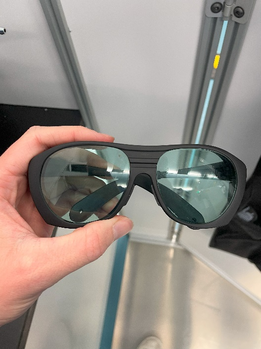{ width="300" }
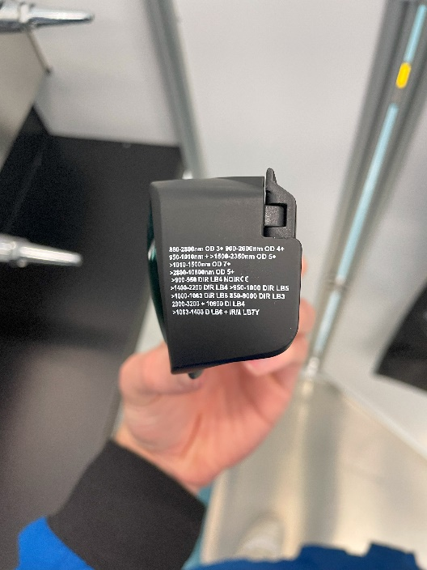{ width="300" }

*Figure 1: (Left) A pair of laser safety goggles permitted in the Laser Shock Testing
Area. (Right) Ensure that your goggles have sufficient coverage over the wavelengths in
use (OD 5+), as printed on the side of the goggles.*

- Lab coats, pants, and closed-toe shoes must always be worn inside the lab.
- Wear nitrile gloves, especially during laser alignment.
- Wear heat-resistant gloves when handling materials exposed to the heating laser.

## Summary of hazards and hazard mitigation methods

**Table III:** Identified hazards and hazard mitigation measures.

| Category | Hazard | Mitigation methods |
| --- | --- | --- |
| Beam hazards | Burns to skin | <ul><li>Lab coat and pants must ALWAYS be worn in the lab.</li><li>During laser alignment and other times of high exposure risk, wear nitrile gloves.</li><li>Laser operators must always be aware of the beam path and actively position themselves to avoid exposure.</li></ul> |
| Beam hazards | Eye exposure | <ul><li>When lasers are on, proper laser safety goggles must ALWAYS be worn.</li><li>Ensure the laser safety goggles are rated for the wavelengths in use and inspect them for damage or degradation before each use.</li><li>Avoid placing your head anywhere near the beam path. Keep your head clear of the plane of the optical bench.</li></ul> |
| Beam hazards | Drive laser exposure outside the Laser Shock Testing Area | <ul><li>The drive laser physical shutter must only be open when it is actively in use by a laser operator.</li><li>When entering or exiting the Laser Shock Testing Area, the physical shutter must be closed while the door is open.</li><li>To signal the shutter to be closed, a person entering the Laser Shock Testing Area knocks on the door. Those working on the laser verify that the person should have access to the room, then close the shutter and open the door.</li></ul> |
| Non-beam hazards | Sound hazards | <ul><li>Notify everyone within the Laser Shock Testing Area before any shots are carried out.</li><li>Those within the area should position themselves as far away from the target as possible and cover their ears or wear ear protection if needed.</li></ul> |
| Non-beam hazards | Heated material contact and fumes | <ul><li>Wear heat-resistant gloves when handling materials exposed to the heating laser.</li><li>Proper ventilation and/or containment environments are essential if a material is planned to be heated to high temperatures.</li></ul> |
| Non-beam hazards | Conveyor belt | <ul><li>Beware of pinch hazards associated with the sample conveyor belt movement and motor motion.</li><li>Stay clear of the conveyor when in operation unless in close coordination with the person operating it.</li></ul> |
| Non-beam hazards | Robot movement | <ul><li>Stay clear when a robot arm is in use unless working in close coordination to program the robot and with a person operating the robots.</li></ul> |
| Non-beam hazards | Trip hazards | <ul><li>Always keep the area as clean and orderly as possible. Stow cables in an orderly manner.</li></ul> |
| Non-beam hazards | Electrical hazards | <ul><li>Take the utmost care when handling power supplies.</li><li>High-voltage equipment must not be tampered with, plugged in, or unplugged by those without proper electrical training.</li></ul> |

## Training

- All personnel must complete HEMI-mandated laser safety training before operating or
  working near lasers.
- Training topics include:
    - Laser classification and associated hazards.
    - Use of PPE.
    - Emergency procedures.
- Users must be oriented to the AIMD-L space and receive specific instruction on the
  lasers in AIMD-L from senior members of the laser testing team.

## Incident response

!!! danger "In the event of an accident or exposure"
    1. Cease laser operations immediately and notify the AIMD-L staff.
    2. Notify the lab and WSE LSO and seek medical attention if needed.
    3. Document the incident and corrective actions.

**Important contact information**

| Contact | Number |
| --- | --- |
| Baltimore City Emergency | 911 |
| Campus Emergency | 6-7777 |
| Campus Security | 6-4600 |
| Occupational Health and Safety Office | 6-0450 |
| Health, Safety, and Environment | 608790 |
| Laser Safety Officer – Victoria Lai | (410) 516-0870 |

## Inspections and audits

- Periodic inspections of laser equipment and facilities by the LSO.
- Annual audits to ensure compliance with the Laser Safety Plan.

## Recordkeeping

Maintain records of:

- Laser inventory and classifications.
- Training completion.
- Incident reports and corrective actions.
- Annual audits and inspections.

## References

- ANSI Z136.1 – Safe Use of Lasers.
- OSHA Standards for Laser Safety and Health.

## Plan review and updates

!!! note "Open item"
    This section is empty in the source document.

## Optical layout

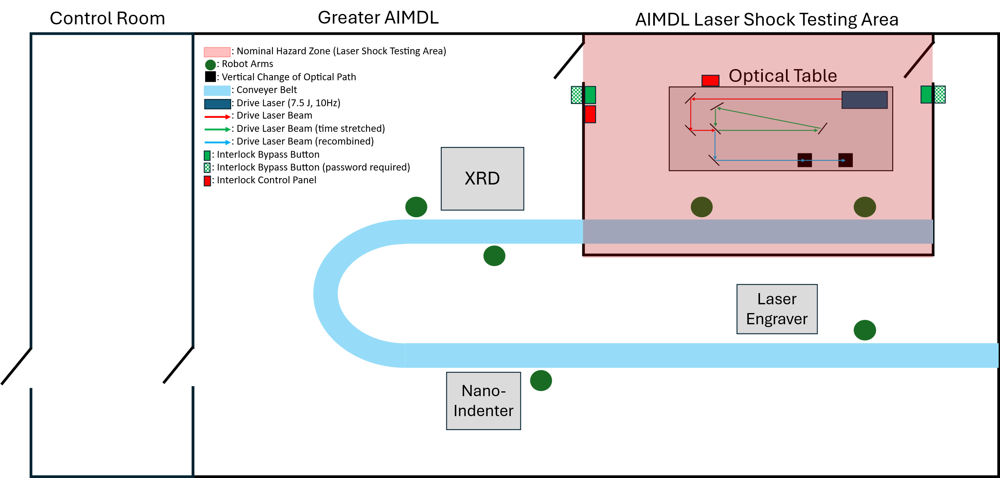

*Figure 2: Diagram of the AIMD-L facility with the laser nominal hazard zone (in red).*

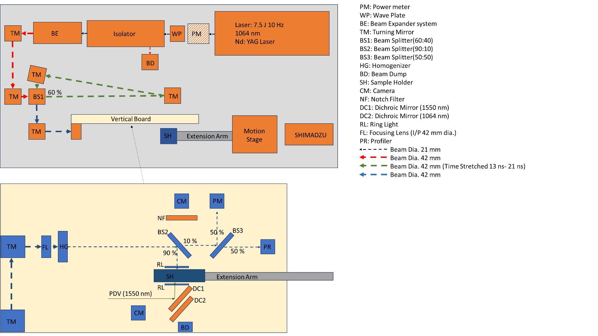

*Figure 3: Detailed layout of the optical table in the Laser Shock Testing Area.*

## Supplementary information

### Interlock control panels and bypass buttons

Locations of all interlock control panels along with the interlock bypass buttons:

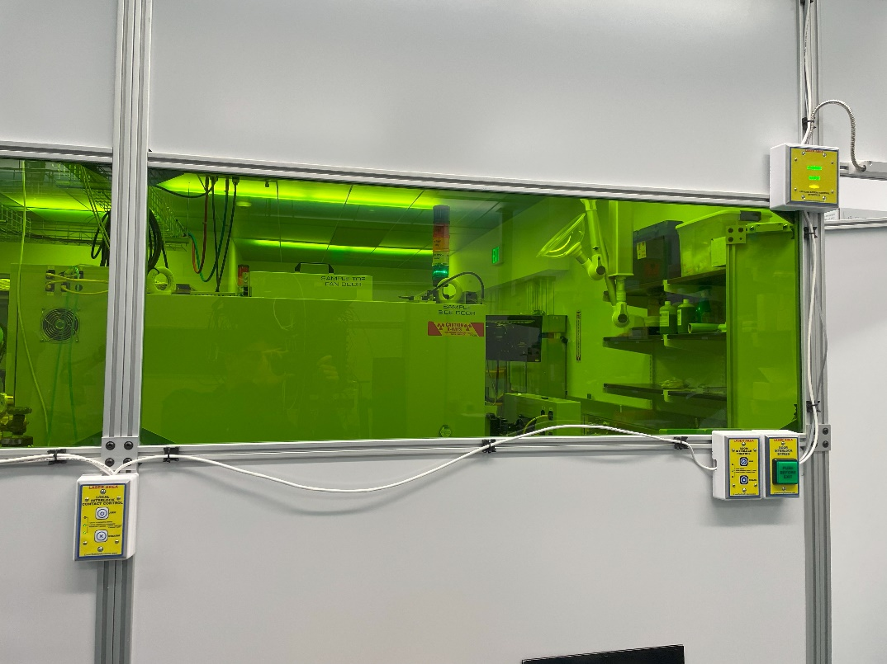

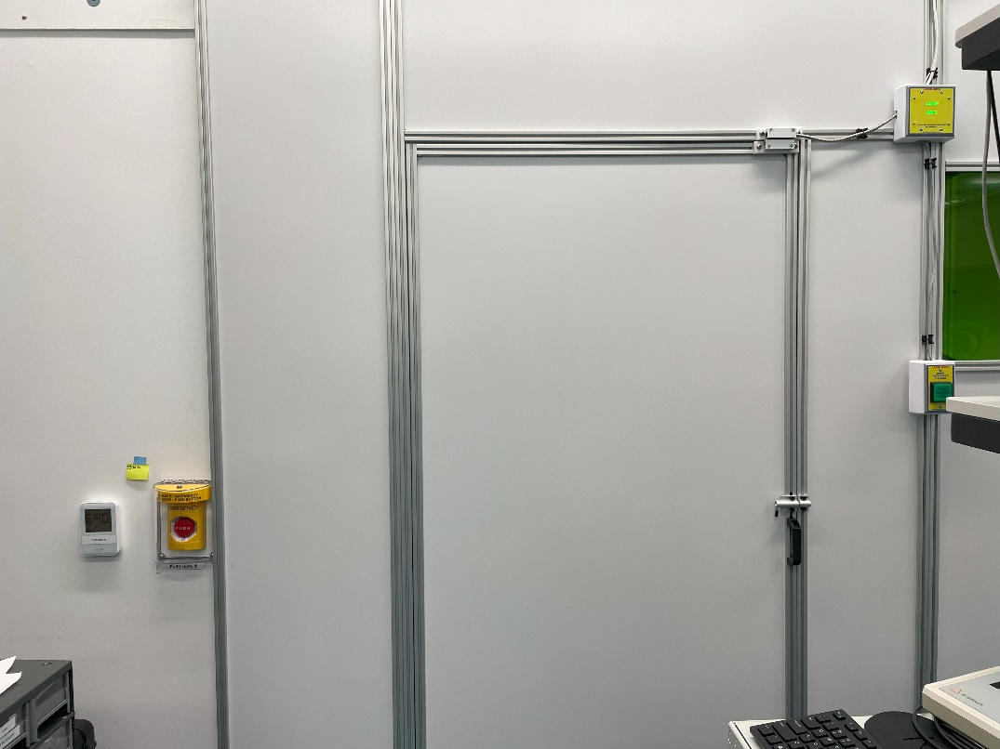

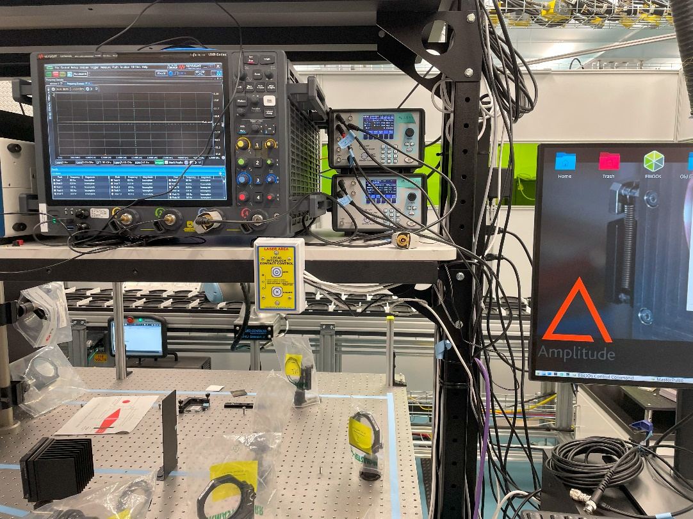

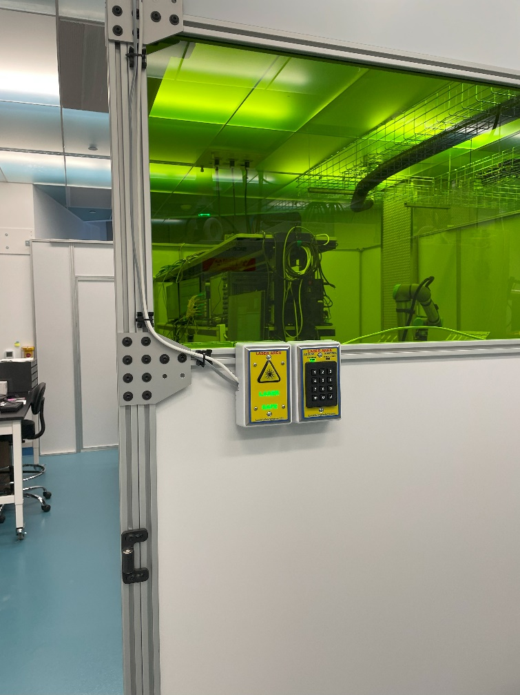

### AIMD-L laser testing area

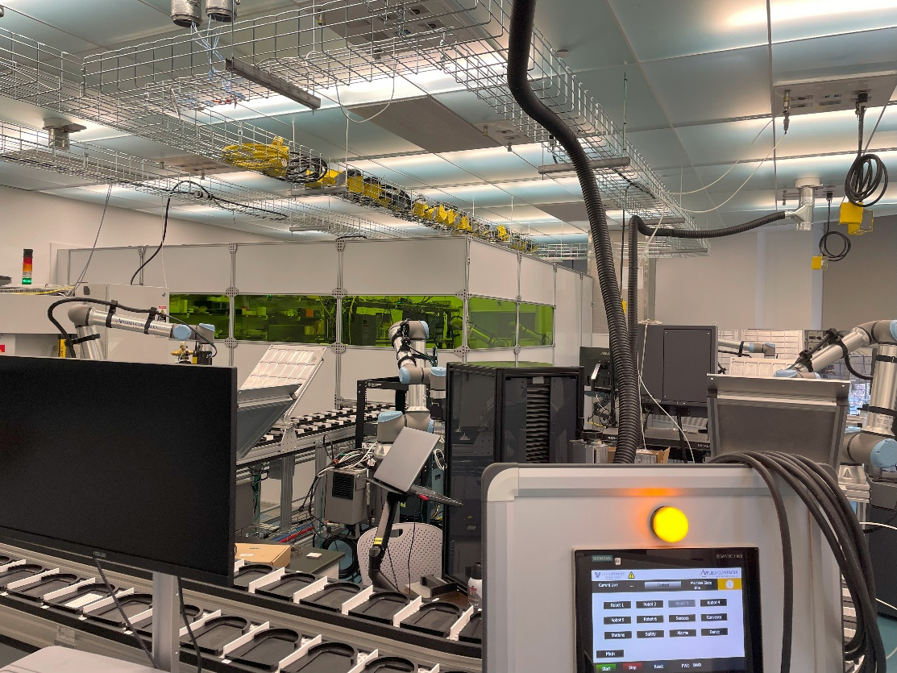

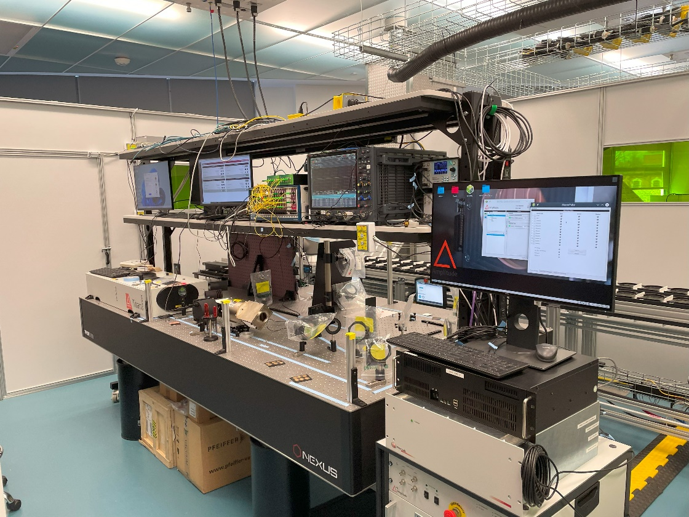

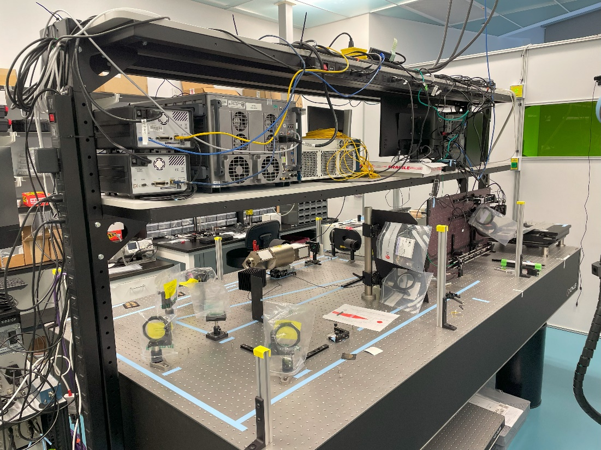

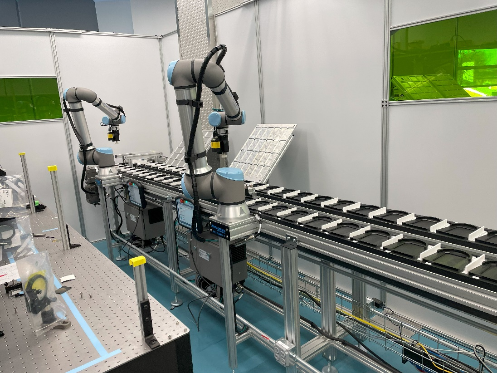

### Lasers (Class 3 and above)

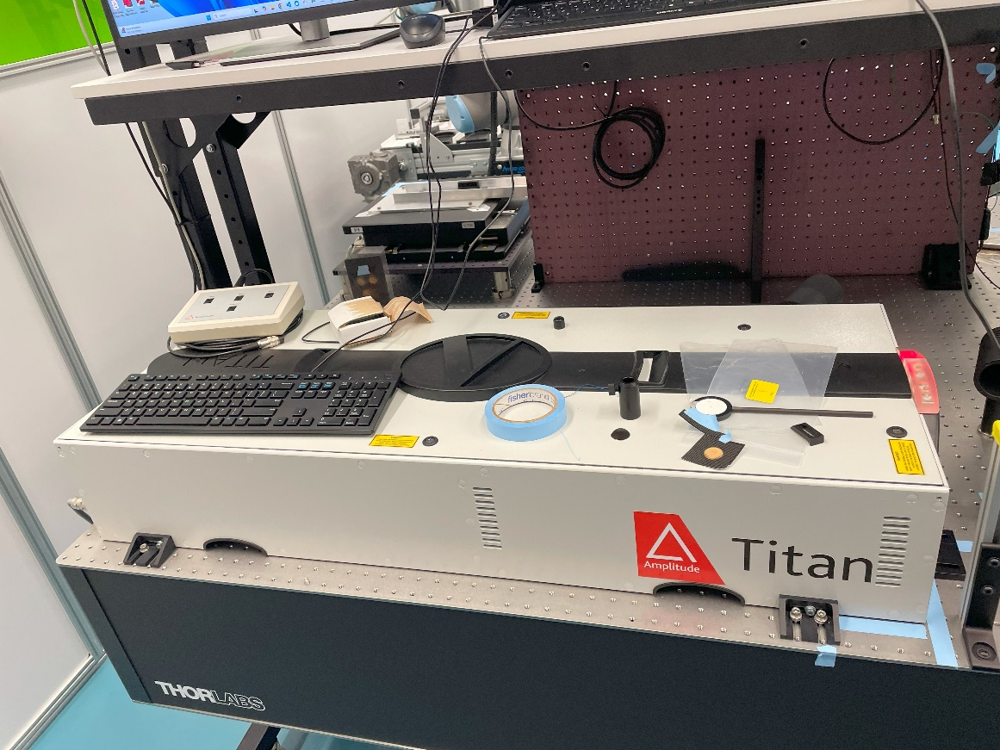

*Drive laser.*

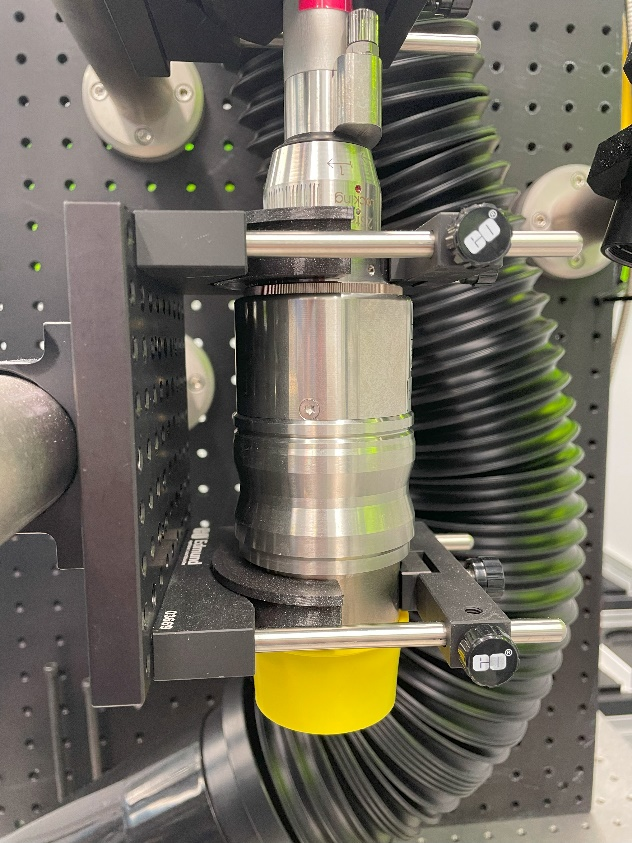

*Heating laser.*

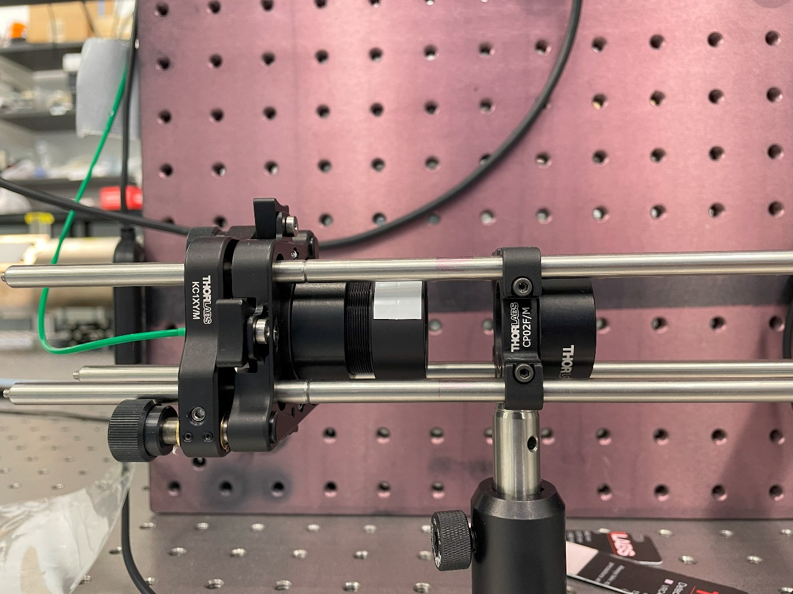

*PDV laser.*
