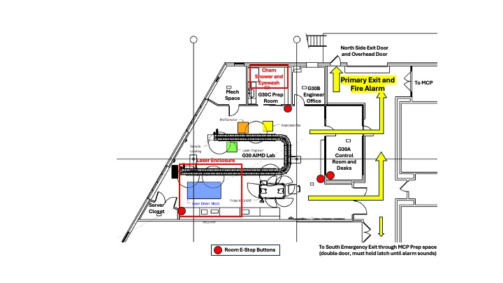
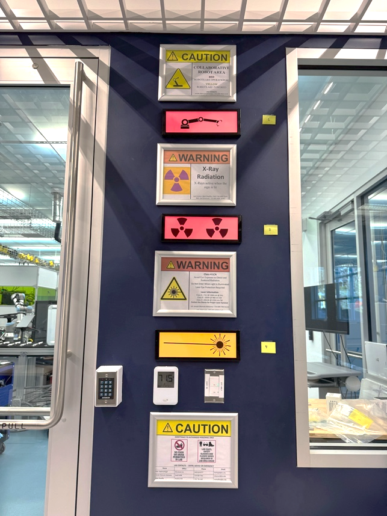

# Lab Layout Access and Space Descriptions

<figure>
  
  <figcaption><em>Stieff G30 AIMD Lab layout. Yellow arrows indicate egress and emergency exits, with the primary exit on the north side. The rally point is in front of the building, across the lot by the picnic tables. Red dots indicate room E-stop locations. The chemical shower and eyewash are in the G30C Preparation Space. Select the image to open it for closer viewing.</em></figcaption>
</figure>

## Lab Layout and Emergency Exits

The primary access route for ordinary use is through the G30A Control Room. The
control room door is secured by a J-card reader; however, the door from the
control room into the lab space is not a sufficient barrier to hazards.
Authorized-user controls and visitor escort rules must therefore be followed at
all times.

The large double door opening directly onto the hallway is intended primarily
for moving large equipment or materials. It should not be used for routine
entry or exit.

Either the control-room route or the direct hallway door may be used as an
emergency exit. The preferred emergency route is to turn left out of the lab
and exit the building on the north side through the door to the left of the
large overhead door. If necessary, a secondary route is to turn right, pass
through the MCP preparation space, and exit through the south side of the
building.

!!! danger "Emergency rally point"
    The rally point after an emergency evacuation is in front of the Stieff
    building, in the grass across the parking lot by the picnic tables.

## G30A Control Room

The control room is a working, meeting, and observation area for AIMD-L
researchers. It contains desks, monitors, AV equipment, and lighting controls
for the lab space. Lab coats and safety glasses are not required in the control
room, but they must be worn before entering the primary lab space or connected
laboratory spaces.

*Hazard signage and indicator lights in the AIMD-L control room.
These signs alert users to robot, X-ray, and laser hazards and indicate when
certain systems are operating.*

Static and illuminated hazard placards are posted in the hallway corridor and
in the control room. The illuminated placards are activated manually with a
hazard switch inside the lab but tie in with the global safety system. The
switch must be activated when using robotics, lasers, or the X-ray system. A
maglock secures the door from the control room into the lab and can be defeated
with the keypad for entry or the push-to-exit button for authorized lab users.

## G30 Primary Lab Space

The primary lab space contains the major research equipment and the highest
concentration of AIMD-L hazards. Required attire, lab coat, safety glasses, and
any hazard-specific PPE must be worn in this space and in the attached
laboratory spaces.

## G30C Preparation Space

The preparation space is a wet-lab area containing a fume hood, sink, eyewash,
shower, chemical storage, sample preparation tools, and a mechanical polisher.
Because the space is shared, users must keep it clean, labeled, and ready for
safe use by others.

## G30D Machinery Closet

The machinery closet contains the compressor for lab air, the vacuum system for
lab vacuum, and the chiller for the Titan laser water loop. The space should be
entered only by JHU or Transwestern facilities staff and AIMD-L staff. The door
should remain secured except when authorized staff are working in the space.

## G30E Data Closet

The data closet houses racks for AIMD-L edge computing, networking, data
storage, and automation processes. It should be accessed only by AIMD-L staff
and the data or software engineering team. The doors should remain closed when
not in use so that the space can maintain appropriate temperature control.
