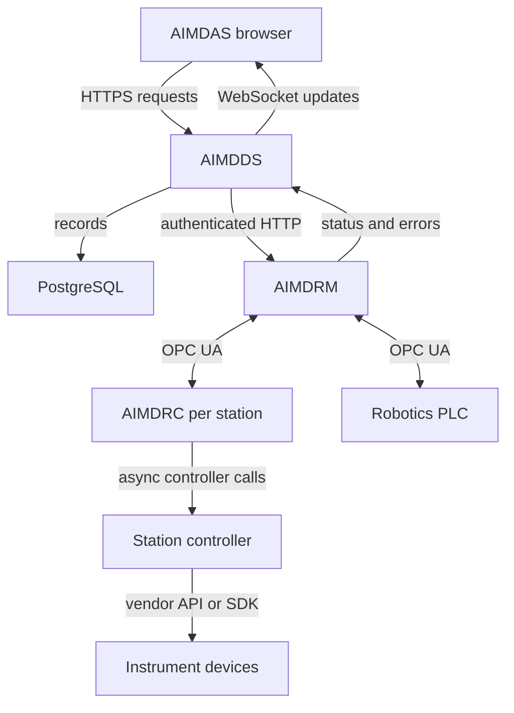

# Control architecture

AIMDDS holds durable records. AIMDRM owns the live run and robotics state. AIMDRC converts station state changes into calls on a controller. AIMDAS displays the results and submits user requests through AIMDDS.

AIMDRM contains both an OPC UA **server** for station clients and an OPC UA **client** for the Siemens robotics server. Its HTTP views use an administrative OPC UA client to submit commands to the long-lived server. The browser does not directly control OPC UA or vendor hardware.

## From script upload to completed run

1. An operator uploads a schema-version-2 JSON script. AIMDDS validates its structure and coordinate requirements, records instruction line ranges, and stores the original file.
2. The operator selects infeed/outfeed physical station numbers and a mapping of buffer slots to sample IDs. AIMDDS checks sample availability, creates the run and instruction-status records, and selects available stored transforms.
3. AIMDDS sends a multipart start request to AIMDRM containing the script, sample metadata, status IDs and transforms. The administrative client creates OPC UA run, sample and station instruction nodes.
4. The server preloads the infeed buffer. It reports `OperationState` and `OperationError` so a failed preload can be returned to the caller rather than silently starting a run.
5. The scheduler follows each sample's instruction index and current buffer location. It requests transport for samples that are not yet at their target station, and queues eligible samples already in its buffer.
6. The station assignment worker waits for `REST`, prepares sample-specific input, writes sample/run identity, and writes `WARM` last.
7. AIMDRC closes station access and calls `warmup()`. On normal completion it opens access and requests `INGR`. AIMDRM completes the robotics handshake and sets `PROG`.
8. AIMDRC closes access and calls `run()`. It writes any reserved `result` value before opening access and setting `EGRS`. AIMDRM completes egress, observes `CPLT`, and advances the sample.
9. After every sample finishes the instructions and reaches the outfeed buffer, the run can complete. Clearing the terminal run removes live manager state; the database history remains.

## Three different kinds of state

| State | Owner | Persistence |
| --- | --- | --- |
| Run records, instruction history, notes, error occurrences, coordinate history | AIMDDS | Database and stored uploads |
| Active runs, assignment queues, current station identities, sample transform cache | AIMDRM | Process and OPC UA address space |
| Actual positions, loaded samples, test progress, device files | PLC and instruments | Device-specific; not reconstructed by a database status alone |

A restarted process is not evidence that equipment returned to its initial condition. See [data and recovery](operations/data-and-recovery.md).

## Logical station and physical station

| Logical key | Display name | Physical number |
| --- | --- | ---: |
| `helix` | HELIX | 1 |
| `maxima` | MAXIMA | 4 |
| `sphinx` | SPHINX | 5 |
| `profile` | Zygo profilometer | 5 |
| `engrave` | Engraver | 6 |
| `coord` | Coordinate station | 6 |

The robotics interface accepts physical stations 1–6, including stations without a supplied experiment controller. Each buffer contains 48 slots; the conveyor state contains 225 positions. Shared physical numbers matter when interpreting station enable/robot-auto controls and buffer occupancy. The [OPC UA reference](reference/opcua.md) separates these concepts.

## Source map

`aimdds/src/api/apps/system/models.py`, `serializers.py`, and `requests.py`; `aimdrm/src/api/apps/opcua/admin_client.py`, `server.py`, and `robotics/client.py`; `aimdrc/src/api/apps/opcua/client.py`. See [snapshot provenance](reference/source-snapshot.md).
