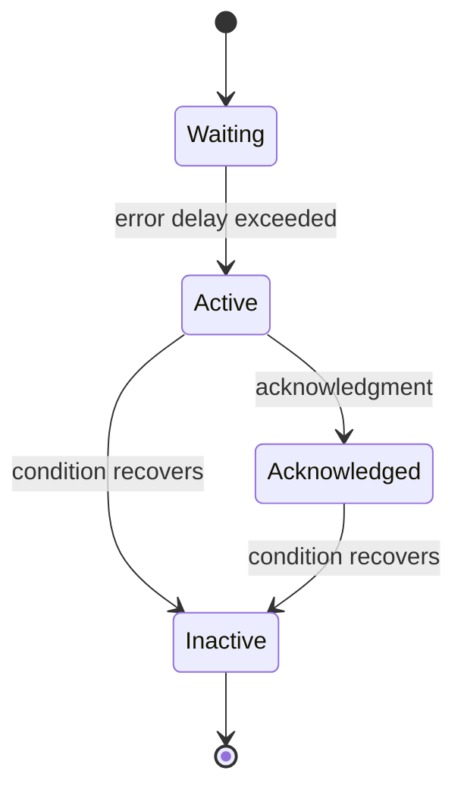

# Control troubleshooting

Begin with the run ID, instruction number, logical station, sample ID/IGSN, last status and active error details. Use the [error catalog](../reference/error-codes.md) for the canonical recommended action and the [source review notes](../reference/source-review.md) for known gaps.

## State-based diagnosis

| Symptom | Source-backed checks |
| --- | --- |
| Run start rejected | Schema version, point structure, duplicate sample/slot mapping, sample already in use, missing initial coordinate transform, occupied infeed buffer |
| Stuck at `REST` | Sample instruction index and destination buffer membership; manager assignment queue and run task logs |
| Stuck at `WARM` | Controller readiness checks and active hardware errors; warmup exception in station log |
| Stuck at `INGR` | PLC ingress Boolean, robotics state, actual sample position and manager robotics log |
| Stuck at `PROG` | Controller acquisition/motion loop, vendor UI, error occurrence details, unexpected run-task exception |
| Stuck at `EGRS` | PLC egress Boolean and transfer task; station return does not complete robotics egress |
| Instructions finished but run not `CPLT` | Every sample must also appear in the configured outfeed buffer |
| `CNLG` remains active | Station cancellation result, manager wait for station release, disconnected client |
| `CNLD` but instrument not at expected position | Shared client does not inspect cancel status strings; SPHINX or HELIX physical recovery may still be needed |
| Browser shows old state | Browser connection, AIMDDS/Daphne logs, manager status publisher and source-service reachability |
| Client disconnect code active | Client process, manager host/port, certificates, selected `NAME` and namespace; monitor clears occurrence on reconnection |
| COORD 6700 | Inspect raw image, overlay, metadata reasons and calibration; no valid transform was published |
| COORD persistence log error | Compare live cache and database transform history; persistence failure does not discard a valid cache |
| SPHINX motion timeout | Read measured position and InView state; command outcome can be unknown |
| MAXIMA missing point files | Check skipped robot moves and collection return status; normal instruction completion permits skipped points |
| HELIX missing waveform or shot | Inspect CSV attempt status, scope save path and per-shot save/alignment errors |

Do not repair apparent state discrepancies by manually writing `CPLT` or erasing errors. Status transitions trigger other operations, including sample movement and coordinate caching.

## Error lifecycle

`wait_until_with_error()` polls an async predicate. With an error service, exceeding `timeout_s` creates an occurrence and **continues polling**. When the predicate succeeds, the helper clears that occurrence. The timeout is an error-reporting delay, not necessarily a maximum operation duration. Without an error service, the configured exception may be raised instead; with `error_cls=None`, polling continues after logging.

Not every error follows this lifecycle. Invalid settings can log a warning and continue with defaults; MAXIMA collection has explicit soft/hard outcomes; COORD refusal raises; the AIMDRC cancellation wrapper imposes a real timeout.

## Error ranges

| Range | Meaning |
| --- | --- |
| 1000–1999 | HELIX |
| 4000–4999 | MAXIMA |
| 5000–5499 | SPHINX |
| 5500–5999 | Reserved for Zygo controller |
| 6000–6499 | Reserved for engraver controller |
| 6500–6999 | COORD |
| 10100–10199 | Run-client health and cancellation timeouts, under run manager allocation |
| 10200–10299 | Robotics and PLC alarms |

Severity, active state and acknowledgment answer different questions. A WARNING may describe a substituted setting; ERROR/CRITICAL do not universally cause an automatic stop. Read the calling subsystem's behavior rather than inferring control action from severity alone.

## Collect a useful diagnostic record

Record the complete error occurrence (code, time, details, active/acked), matching manager/client log interval, physical sample location, current script and instruction, and controller output artifacts. For transform issues include `metadata.json`, `raw.png` and `overlay.png`. Preserve the original script and source revisions so the behavior can be reproduced without changing an existing historical record.

See [service logs](../setup/services.md#logs-and-process-maintenance) and [data/recovery boundaries](data-and-recovery.md). Hardware intervention follows the relevant instrument procedure and personnel authorization.
