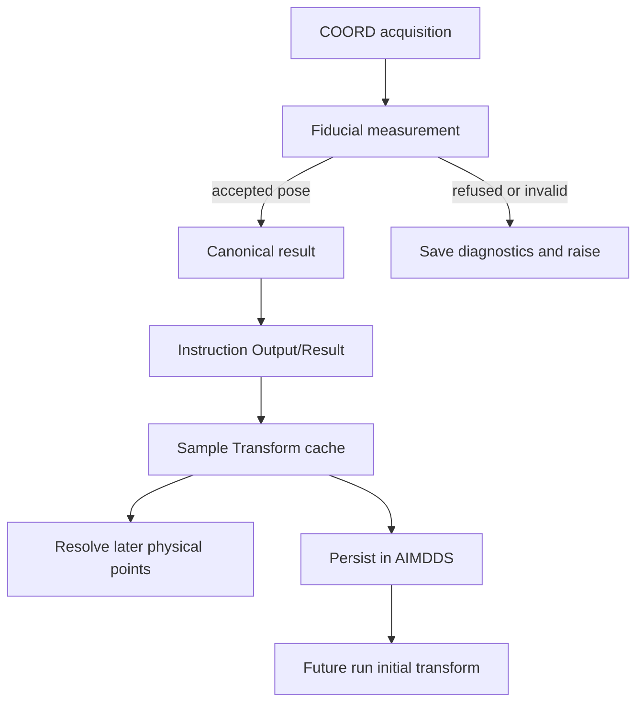

# Coordinates and transforms

The software distinguishes sample coordinates, sample-holder coordinates and HELIX flyer-grid indices. Device coordinates remain inside station adapters.

| Frame | Values | Units | Transformation |
| --- | --- | --- | --- |
| `sample_holder` | `[x, y]` physical points | `mm` or `cm` in scripts | AIMDRM converts centimeters to millimeters |
| `sample` | `[x, y]` relative to the detected sample frame | `mm` or `cm` | Convert to millimeters, then apply the sample-to-holder transform |
| `flyer_grid` | `[row, column]` | Omitted | HELIX keeps integer grid indices; station calibration determines physical positions |

The sample-holder origin published by COORD is the designated corner of the sample window. Its offset from the vision-detected holder origin is configured by `SAMPLE_WINDOW_ORIGIN_X_MM` and `SAMPLE_WINDOW_ORIGIN_Y_MM`. Avoid substituting an older instrument-native origin for this frame.

## Transformation equation

For sample coordinates in millimeters, the holder position is:

```text
holder_x = matrix[0][0] * sample_x + matrix[0][1] * sample_y + translation[0]
holder_y = matrix[1][0] * sample_x + matrix[1][1] * sample_y + translation[1]
```

The 2×2 matrix is dimensionless; translation and `rms_error_mm` are in millimeters. Centimeter input is multiplied by 10 before applying this equation.

## Result lifecycle



COORD subtracts the configured holder-origin offset when constructing the translation. AIMDRC writes the JSON result before egress. At `CPLT`, AIMDRM validates and caches it, adds `sample_instruction_status` and posts it to AIMDDS. Invalid/missing results block normal coordinate completion and cause cancellation. Photo-only acquisitions bypass transform caching/persistence.

AIMDRM persistence is best effort: a valid live cache can exist even when the database post fails. Inspect manager logs and transform history after such a failure; do not assume a future run has the same transform.

## Station conversion boundaries

| Controller | Device conversion |
| --- | --- |
| MAXIMA | `robot/robot.py::transform_point()` maps holder millimeters and detector-distance offset into robot coordinates |
| SPHINX | `coordinates.py::transform_point()` maps holder millimeters into microscope meters; motion stage applies the separate microscope-to-indenter offset |
| HELIX | Flyer tracking maps grid indices into stage/global coordinates, then `coordinates.py` produces holder and optional sample coordinates for output |
| COORD | Vision solver measures pose and `_build_transform()` produces the canonical holder-frame transform |

SPHINX `z_pos` is in meters even though its incoming XY points are in millimeters. HELIX grid bounds in this snapshot are rows 2–6 and columns 2–6. A flyer index is not a physical coordinate.

## Validation and use

AIMDDS/AIMDRM validate transform shape and finite numbers. A stored transform must remain physically applicable to the current mounting; the software does not demonstrate that from sample identity alone. Configure COORD calibration and detection thresholds from the approved bench configuration. Source defaults are not a metrology acceptance study.

## Source map

AIMDRM `apps/coordinates.py`, `apps/opcua/server.py`; AIMDDS `CoordinateTransformSerializer` and model; COORD `controller.py`, `detection/constants.py`, `detection/solve.py`; each station's coordinate adapter. [COORD controller](../controllers/coord.md).
