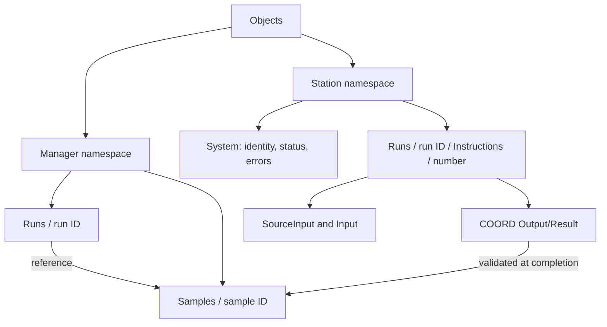
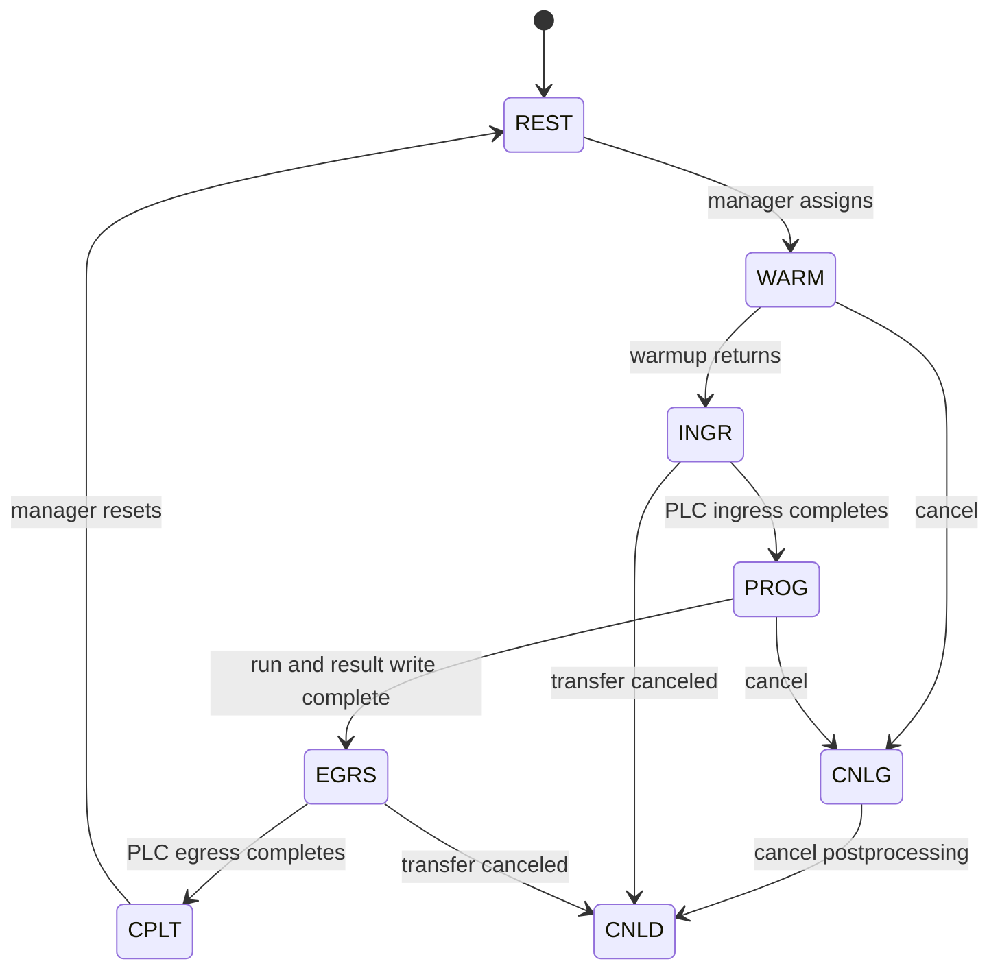

# OPC UA reference

AIMDRM hosts the lab OPC UA server at `opc.tcp://<manager-domain>:4843`. It separately connects to the robotics PLC OPC UA server. Namespace indices are assigned at runtime: resolve the configured namespace URI rather than hard-coding an index.

## Lab address space

The manager namespace URI is `settings.DOMAIN`; each station namespace is `settings.DOMAIN:<station-key>`. These may contain folders with identical display names but different namespace indices.

| Namespace | Browse path beneath Objects | Purpose |
| --- | --- | --- |
| Manager | `System/PatchStation` | JSON station-setting command |
| Manager | `System/RunOperation` | JSON run operation command |
| Manager | `Runs/<run_id>/Infeed`, `Outfeed`, `Stations` | Physical routing and logical instruction sequence |
| Manager | `Runs/<run_id>/OperationState`, `OperationError` | Preload/start acknowledgment and structured failure |
| Manager | `Samples/<sample_id>/IGSN`, `InstructionIndex`, `StatusIDs`, `Status` | Identity, progression and database instruction-status associations |
| Manager | `Samples/<sample_id>/Transform` | JSON current transform or initial null |
| Station | `System/RunID`, `SampleID`, `SampleIGSN`, `InstructionNo` | Current assignment |
| Station | `System/Status`, `Time` | Shared status and client heartbeat timestamp |
| Station | `System/Errors/CreateError` | Method that creates a runtime error occurrence |
| Station | `System/Errors/<occurrence>/...` | Occurrence fields described below |
| Station | `Runs/<run_id>/Instructions/<instruction_no>/SourceInput` | Unresolved uploaded settings |
| Station | `Runs/<run_id>/Instructions/<instruction_no>/Input` | Current sample-specific controller kwargs |
| COORD | `Runs/<run_id>/Instructions/<instruction_no>/Output/Result` | Writable JSON result, cleared before transform-producing assignment |

Run nodes also reference their sample nodes. Input dictionaries become OPC UA child objects; leaf values become variables. Lists remain variable values. Node IDs are an implementation detail; use namespace-aware browse paths.

## Station state transitions

`INIT` and `PAUS` also exist in run-level enums; pause/resume are unimplemented. An exception in warmup/run leaves the expected next transition unissued. See [AIMDRC](../repositories/aimdrc.md) for cancellation postprocessing limitations.

## Error occurrence fields

| Field | OPC UA type | Meaning |
| --- | --- | --- |
| `ErrorCode` | Int32 | Canonical registry key |
| `Time` | DateTime | Occurrence timestamp |
| `Details` | String | Runtime diagnostic context |
| `Active` | Boolean | Fault currently active |
| `Acked` | Boolean | Acknowledgment state |

Severity, message, source and recommended action are derived by AIMDDS from the code; they are not copied into the occurrence schema. `ErrorMirror` forwards occurrence changes to the run's error records. The registry and the emitted codes must be updated together.

## Robotics address space

AIMDRM's robotics client uses the configured Siemens namespace (`http://www.siemens.com/simatic-s7-opcua` in production). Its node strings reference PLC structures such as `"Station Controller Data"."Station N"."Ingress"` and `"Egress"`. An ingress/egress Boolean returning to false acknowledges completion of that PLC action.

Buffer slots use `ProcessedState`: 0 empty, 1 preprocessed, 2 postprocessed, 3 error. `MachineStatus` is 0 idle, 1 starting, 2 running, 3 stopping. These integers are not station status strings. The client also manages ingress/egress priority lists, sample IDs and station enable/robot-auto values. Consult `robotics/client.py`, `buffer_lists.py` and `priority_lists.py` for exact PLC node strings before integrating a diagnostic client.

## Security and timing

The manager registers station certificates and an administrative certificate using `CertificateUserManager`. Stations use their own certificate/private key plus the manager certificate. The configured security policy is Basic256Sha256 with signing and encryption. The custom permission rules allow station-user write requests; they do not inspect request bodies to enforce per-node station ownership.

AIMDRC defaults include a 1-second ping, 2-second reconnect delay, 500-millisecond subscription publishing interval and 20-second cancellation timeout. AIMDRM's scheduler interval is 1 second and client-monitor interval is 5 seconds. These are software settings, not guaranteed hardware response times.

## Source map

AIMDRM `opcua/server.py`, `admin_client.py`, `permissions.py`, `error_schema.py`, `robotics/`; AIMDRC `opcua/client.py`, `error_service.py`; both `config/settings/base.py` files. [Source snapshot](source-snapshot.md).
