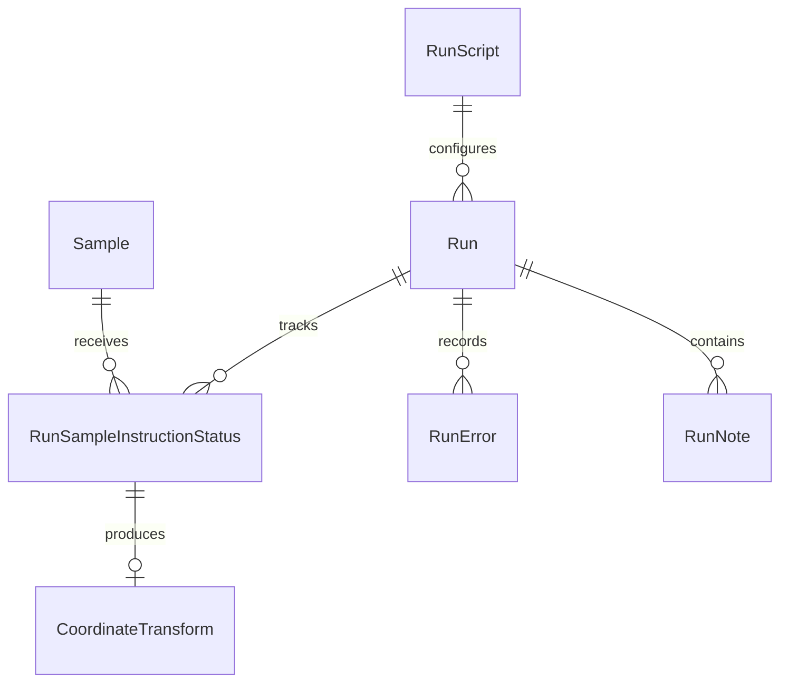

# AIMDDS data service

AIMDDS is the Django data and authentication boundary for the application. Django REST Framework exposes HTTP resources; Channels/Daphne distributes WebSocket updates; Celery handles configured background work. Production settings use PostgreSQL and integrate with the data portal. The run manager controls hardware through its separate process.

## Responsibilities

* Authenticate browser users and trusted services.
* Store profiles, appointments, comments, media and sample references.
* Validate and store run scripts; create immutable run inputs and per-sample instruction statuses.
* Forward run lifecycle requests and physical-station settings to AIMDRM.
* Store error occurrences while deriving message, severity, source and recommended action from the canonical registry.
* Persist coordinate transforms with links to the producing sample instruction.
* Present sample experiment data from the configured data portal.

## Record relationships

A run also holds its selected samples and infeed/outfeed stations. Each instruction status identifies one sample at one zero-based instruction number. A coordinate transform belongs to that instruction-status record, allowing later runs to select the newest recorded transform for the sample.

## Validation boundaries

Script upload requires schema version 2 and a nonempty instruction list. Physical point structures and COORD input are checked centrally. Station-specific option dictionaries are parsed by each controller at execution time; successful upload is not complete validation of every hardware option.

Run creation requires an initial status of `INIT`, at least one sample, unique slot-to-sample assignments and a supported script schema. Slots are zero-based, 0–47. Samples already in a nonterminal run cannot join another run. On update, run properties other than status are immutable. Script metadata can be edited, but uploaded file contents cannot be replaced in place; upload a new script for changed instructions.

Coordinate records are immutable through the exposed API. Duplicate submissions for the same instruction status return the existing record. AIMDRM supplies `sample_instruction_status`; users do not write transform matrices into a run script.

## HTTP and WebSockets

See the complete [API reference](../reference/api.md), including methods, permission boundaries, list filtering, start payloads and WebSocket routes. API schema, Swagger UI and ReDoc are registered under `/api/schema/`.

The standard browser scheme uses an `access_token` cookie. Service requests use separate shared-secret authentication paths (`AIMDRM_SECRET` and data-portal credentials). These credentials belong in deployment configuration, never in scripts uploaded by operators.

## Source map

`aimdds/src/api/apps/base/`, `apps/system/`, `apps/auth/`, `config/settings/`, `config/routing.py`; `README.md`. [Setup](../setup/services.md) · [source snapshot](../reference/source-snapshot.md).
